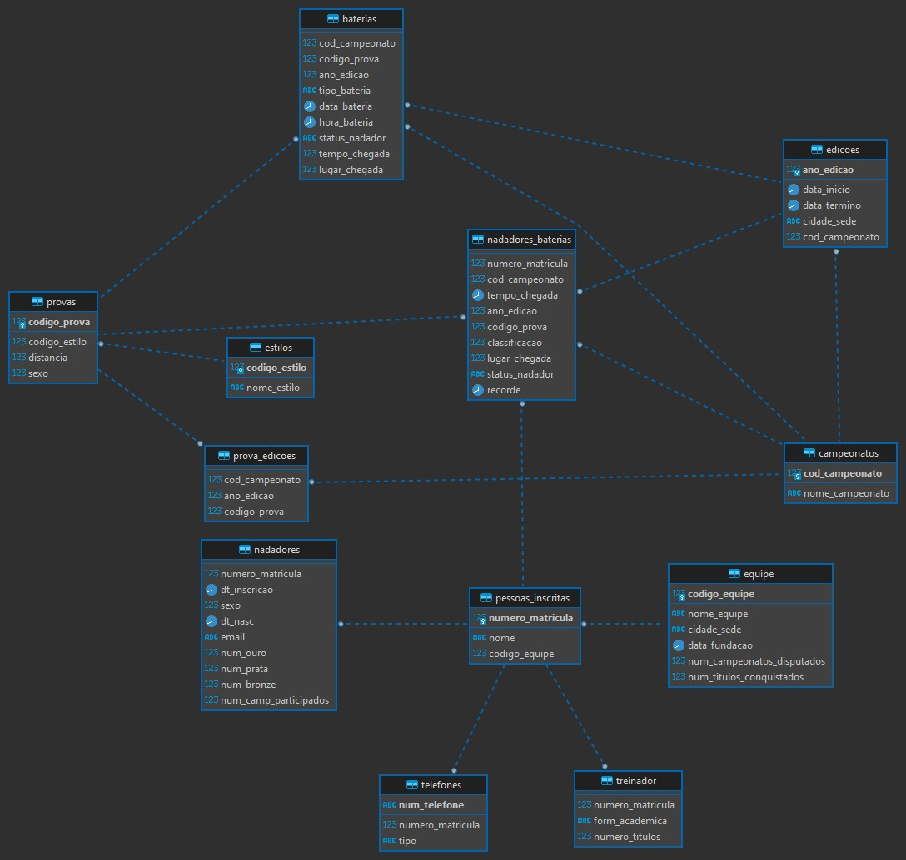

## Grupo 3 - Participantes
 - Francieli dos Reis 
 - Joice Martins 
 - Laurieny Jayne 
 - Marlon Souza
 - Matheus Santos
 

## Projeto Final : Campeonato de Natação

A Confederação Brasileira de Desportos Aquáticos (CBDA) deseja informatizar seu cadastro.

Todas as pessoas inscritas na CBDA são cadastradas. Cada pessoa possui número único de matrícula e um nome, sejam elas nadadores ou treinadores.

Sobre os nadadores é mantida a uma data histórica de inscrição na CBDA, o nome, sexo, data de nascimento, email e telefones de contato, cada qual com um tipo (residencial, celular ou contato). Também é registrado o número de medalhas de ouro, prata e bronze que obteve em sua carreira e o número de campeonatos de que já participou.

Sobre os treinadores é mantida sua formação acadêmica e o número de títulos que obteve.

Todo o inscrito na CBDA está associado a uma equipe. Cada equipe é identificada por um código e possui um nome, cidade sede, data de fundação, número de campeonatos disputados e número de títulos conquistados.

Todas as provas possíveis em um campeonato de natação são previamente cadastradas (por exemplo: 200m nado peito masculino). Para isto são cadastrados os estilos (borboleta, costas, peito, livre, medley e revezamento), que receberão um código único e um nome. Cada prova é qualificada pelo estilo, pela distância em metros e pelo sexo dos participantes.

O cadastro inclui as informações de todos os campeonatos oficiais de natação que a CBDA promove, cada possuindo um nome. Cada edição de um campeonato é identificada, em conjunto, pelo identificador do campeonato e pelo ano da edição, indicando, ainda, as datas de início e de término e a cidade que sediará a edição.

Para cada prova que já foi realizada em um campeonato é registrado o recorde, indicando a data, o tempo e o nadador que o estabeleceu.

A cada edição de um campeonato são disputadas diversas provas, divididas em baterias. Cada bateria de uma prova possui um tipo (classificatória, semifinal e final) e é disputada em uma determinada data e hora.

Cada nadador se inscreve em diversas provas de uma edição do campeonato e posteriormente é alocado em uma de suas baterias. Após o término da bateria, é registrado o status do nadador (classificado ou desclassificado), o tempo e o lugar de chegada.

### Diagrama
